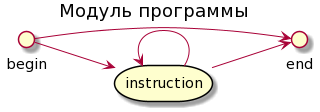
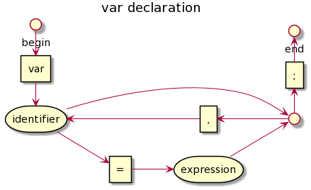

# KIRPITCH 2

Учебный проект по реализации интерпретатора собственного языка, работающего
только с переменными целочисленного типа.

Примеры исходников имеют расширение .ksc

## РАЗБОР ИСХОДНЫХ ФАЙЛОВ

Исходные файлы из набора символов переводятся в наборы лексем, наборы лексем переводятся в древовидные структуры инструкций, и уже последниие имеют удобное представление программы для интерпретирования.

## LEXEME. ТИПЫ ЛЕКСЕМ

- Пустая лексема - единственная, состоящая из 0 символов.
- Пробельная - строка, включающая только симолы: пробел, табуляцию, конец строки.
- Знак - состоит из одного или двух символов. Список возможных знаков:
    1. ++ -- && ||
    2. += -= *= /= %= != >= <=
    3. \> < ! + - * / % = , ( ) { }
- Слово - состоит из букв и цифр
- Строка - начинается и заканчивается двойной кавычкой, между которыми двойная ковычка не встречается.
- Однострочный комментарий - начинается с двух слешей / и продолжается до конца строки.
- Многострочный комментарий - начинается комбинацией двух символов /* и заканчивается первой же (вложенность не принимается) комбинацией двух символов \*/.

## LEXEME. КОНЕЧНЫЙ АВТОМАТ

Автомат лексем имеет состояния, характеризующиеся одним из маркеров:

- complited - лексема завершена и не может быть продолжена никаким символом, т.е. следующий символ точно начинает следующую лексему
- extendable - лексема может считаться завершённой, но также может быть продолжена некоторым символом
- not complited - на данном этапе лексема обязана быть продолжена некоторым символом и не может пока считаться завершённой. Завершение на данном состоянии лексемы означает ошибку

Новый символ продолжает лексему из текущего состояния автомата. Если из текущего состояния нет перехода по принятому символу, то текущая лексема обрубается, а этот символ начинает новую лексему. Если лексему обрубили в состоянии, отличном от complited или extendable, то обнаружена синтаксическая ошибка в тексте. Если из стартового состояния автомата нет перехода по символу, то обнаружена синтаксическая ошибка в тексте.

## ЯЗЫКОВЫЕ КОНСТРУКЦИИ

## МОДУЛЬНАЯ РЕАЛИЗАЦИЯ

## СТРУКТУРА ДЕРЕВА ПРОГРАММЫ
