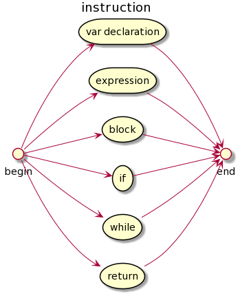
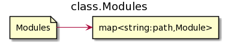
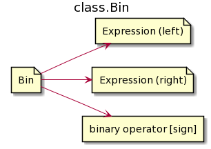

# KIRPITCH 2

Учебный проект по реализации интерпретатора собственного языка, работающего
только с переменными целочисленного типа.

Примеры исходников имеют расширение .ksc

## РАЗБОР ИСХОДНЫХ ФАЙЛОВ

Исходные файлы из набора символов переводятся в наборы лексем, наборы лексем переводятся в древовидные структуры инструкций, и уже последниие имеют удобное представление программы для интерпретирования.

## LEXEME. ТИПЫ ЛЕКСЕМ

- Пустая лексема - единственная, состоящая из 0 символов.
- Пробельная - строка, включающая только симолы: пробел, табуляцию, конец строки.
- Знак - состоит из одного или двух символов. Список возможных знаков:
    1. ++ -- && ||
    2. += -= *= /= %= != >= <=
    3. \> < ! + - * / % = , ( ) { }
- Слово - состоит из букв и цифр
- Строка - начинается и заканчивается двойной кавычкой, между которыми двойная ковычка не встречается.
- Однострочный комментарий - начинается с двух слешей / и продолжается до конца строки.
- Многострочный комментарий - начинается комбинацией двух символов /* и заканчивается первой же (вложенность не принимается) комбинацией двух символов \*/.

## LEXEME. КОНЕЧНЫЙ АВТОМАТ

Автомат лексем имеет состояния, характеризующиеся одним из маркеров:

- complited - лексема завершена и не может быть продолжена никаким символом, т.е. следующий символ точно начинает следующую лексему
- extendable - лексема может считаться завершённой, но также может быть продолжена некоторым символом
- not complited - на данном этапе лексема обязана быть продолжена некоторым символом и не может пока считаться завершённой. Завершение на данном состоянии лексемы означает ошибку

Новый символ продолжает лексему из текущего состояния автомата. Если из текущего состояния нет перехода по принятому символу, то текущая лексема обрубается, а этот символ начинает новую лексему. Если лексему обрубили в состоянии, отличном от complited или extendable, то обнаружена синтаксическая ошибка в тексте. Если из стартового состояния автомата нет перехода по символу, то обнаружена синтаксическая ошибка в тексте.

## ЯЗЫКОВЫЕ КОНСТРУКЦИИ

bin - бинарный оператор: + - * / % = < > == != <= >= += -= *= /= %= && ||

left unary - левый унарный оператор: ! ++ -- + -

right unary - правый унарный оператор: ++ -- + -

## ОПИСАНИЕ ЯЗЫКОВЫХ КОНСТРУКЦИЙ

### Модуль программы

Программа состоит из модулей - исходных файлов (см. МОДУЛЬНАЯ РЕАЛИЗАЦИЯ). Модуль содержит последовательность инструкций (возможно, пустую). Выполнение программы осуществляется с первой инструкции основного модуля программы (в котором подключаются другие модули).

### Инструкция

Инструкция представляет собой одну из следующих конструкций:

- Объявление переменной
- Выражение
- Блок кода (составной оператор)
- Условный оператор
- Оператор цикла while
- Объявление функции
- Оператор return
- Директива import подключения модуля

Инструкции import и объявления фунции обрабатываются в первую очередь. Перед началом выполнения интерпретатор загружает в память все модули программы и сканирует код в поисках объявлений функций.

### Объявление переменных

Инструкцией var объявляются имена новых переменных, которым можно присваивать начальное значение. Начальное значение по умолчанию - 0. Имена переменных не могут повторяться внутри одной инструкции объявления переменных, а также в разных инструкциях объявления переменных расположенных на одном уровне вложенности блоков {}. Повторное объявление в блоке с большим уровнем вложенности перекрывает предыдущее объявление переменной с таким именем внутри блока, на уровне которого произошло повторное объявление. После выъода из такого блока, копия уничтожается, и с этим именем снова связана старая переменная. Переменные становятся доступны толькопосле их объявления (в отличии от оператора var в javascript).

### Блок

Представляет собой последовательность инструкций, объединяет их в одну составную инструкцию.

### Условный оператор
Сначала вычисляет выражение. Если оно не равно, то оно считается истиным, если равно 0, то ложным. Если условие истино выполняется инструкция после выражения в скобках. При наличии продолжения "else" инструкции в случае ложности условия выполняется инструкция после else.

### Оператор цикла while

Аналогично условному оператору сначала вычисляется выражение-условие цикла. Тело цикла - инструкция, следующая после условия в скобках - выполняется после успешной проверки выражения на истиность. Если условие ложно, выполнение программы переходит к следующей после этого опратора цикла инструкции.

### Объявление функции

Так как подключение модулей и объявление функций объявляются в первую очередь, функции в коде могут использоваться до их объявления.

Объявляемые функции должны иметь разные сигнатуры. В сигнатуру входит только имя функции и количество принимаемых аргументов. По этим параметрам функции совпадать не могут, перегрузка не поддерживается.

Любая функция возвращает значение. По умолчанию это 0. Для возврата иного значения используется инструкция return.

### Оператор return

Оператор завершает выполнение функции. При использовании оператора с выражением функция возвращает значение этого выражения, вычисляемого непосредственно перед выходом из функции. При использовании return без выражения, используется возвращаемое значение по умолчанию - 0.

### Директива import подключения модуля

Сигнализирует интерпретатору о необходимости загрузить модуль к программе. Директива import не заменяется текстом подключаемого модуля. Если модуль уже был загружен, директива игнорируется.

## ТИП ДАННЫХ ПЕРЕМЕННЫХ

В языке используется единственный тип данных - целочисленный со знаком int32.

0 считается ложью, не 0 - истиной.

## ОПЕРАТОРЫ

Левый/правый инкремент/декремент, +, -, * работают как в других языках.

Отрицание ! переводит не 0 - в 0, а 0 в 1.

Результаты логических операций И (&&), ИЛИ (||) и операторов сравнения - 0 или 1.

Деление / целочисленное, % - деление по модулю.

Конструкция variable Х= expression, где Х - это +, -, *, / или %, работает как variable = variable X (expression).

Оператор = и его модификации Х= возвращают значение, присвоенное переменной, которой обязан быть левый аргумент оператора.

## ПОРЯДОК ВЫПОЛНЕНИЯ ОПЕРАТОРОВ

Если операндом оператора является выражение в скобках, то перед вычислением этого оператора (будь он унарным или бинарным) сначала вычисляется выражение в скобках.

Порядок выполнения операторов:

1. Левые унарные (в обратном порядке: справа налево)
2. Правые унарные (в прямом порядке: слева на права)
3. Бинарные

Бинарные операторы выполняются в последнюю очередь в порядке уменьшения приоритета операций: если соседние операторы имеют разный приоритет, то оператор с большим приоритетом выполняется раньше. Если соседние операторы имеют одинаковый приоритет, то эти операторы выполняются в порядке, определённом их правой или левой ассоциативностью.

Правоассоциативные операторы: = и его модификации Х=, остальные левоассоциативные.

Приоритеты операторов:

1. = и его модификации Х=
2. ||
3. &&
4. == != < > <= >=
5. \+ -
6. \* / %

## ВНУТРЕННЯЯ СТРУКТУРА ИСПОЛНЯЕМОЙ ПРОГРАММЫ

Каждый модуль программы загружается как одельный объект, который сохраняется в ассоциативный массив с ключом, который является строкой - путём к модулю (в том виде, в котором он указан в директиве import, либо в котором послан аргументом командной строки для основного модуля).

Код модуля не обязан выделяться фигурными скобками в блок, он автоматически целиком рассматривается как блок самого верхнего уровня - корневой блок.

Классы инструкций наследуются от одного интерфейса Instruction.

При объявлении начальное значение либо задаётся присваиваемым выражением, либо определяется равным 0 по умолчанию.

В условном операторе часть else опциональна.

Возвращаемое значение определяется выражением, либо приравнивается 0 по умолчанию.

Выражение ссылается либо на операнд, либо на бинарный оператор.

На этом классы инструкций закончиваются. Далее идут вспомогательные классы для выражений.

Бинарный оператор ссылается на два своих операнда и определяет бинарную операцию, применяемую к ним.

Операнд является либо элементом, либо сначала ссылается на цепочку унарных операторов.

Элемент - это "элементарный операнд", который может быть одним из 4-х типов.

Перегрузка функций запрещена, проверка на несовпадение сигнатур производится по именам функций и количеству принимаемых ими аргументов. При совпадении обоих этих параметров обнаруживается перегрузка, запрещённая языком.

Объявления функций не входят в объект модуля, а сохраняются отдельно в ассоциативном массиве функций. В нём хранятся функции всех модулей.

Каждый уровень вложенности блока связан с контекстом, в котором хранится информация об объявленных на этом уровне вложенности блока переменных. Повторное объявление переменной запрещено, если в контексте этого блока переменная с таким именем уже объявлена. Однако не запрещено повторять имена переменных, объявленных в блоках уровнями выше текущего. Доступ к переменным по имени в контекстах производится по порядку повышения уровня вложенности, испольуется первое встреченное не пути объявление переменной. Для этого в контексте храится ссылка на контекст родительского блока. У корневого контекста ссылка никуда не ссылается.

По такой древовидной структуре модуля происходит рекурсивное выполнение блоков инструкций и вычисление выражений. Перед выполнением программа приводится к этому виду.

## РАЗБОР ВЫРАЖЕНИЙ

