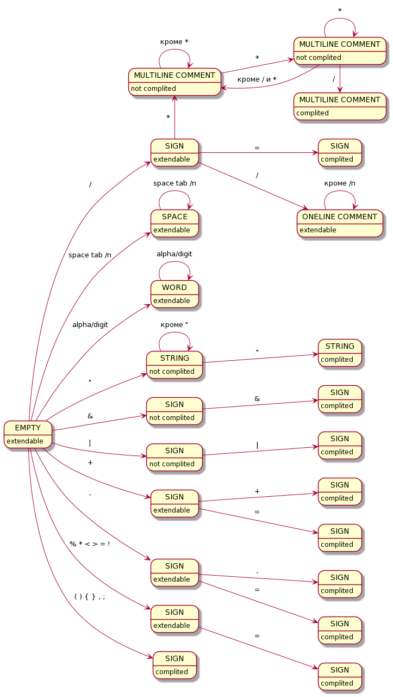
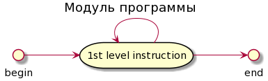
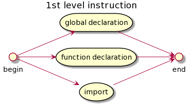
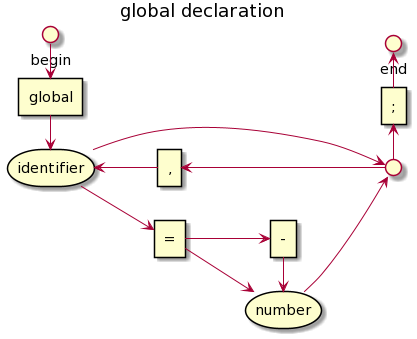
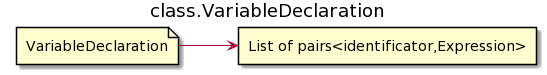

# KIRPITCH 2

Учебный проект по реализации интерпретатора собственного языка, работающего
только с переменными целочисленного типа.

Примеры исходников имеют расширение .ksc

## РАЗБОР ИСХОДНЫХ ФАЙЛОВ

Исходные файлы из набора символов переводятся в наборы лексем, наборы лексем переводятся как инструкции в древовидные структуры, и уже последниие имеют удобное представление программы для интерпретирования.

## LEXEME. ТИПЫ ЛЕКСЕМ

- Пустая лексема - единственная, состоящая из 0 символов.
- Пробельная - строка, включающая только симолы: пробел, табуляцию, конец строки.
- Знак - состоит из одного или двух символов. Список возможных знаков:
    1. ++ -- && ||
    2. += -= *= /= %= != >= <=
    3. \> < ! + - * / % = , ( ) { }
- Слово - состоит из букв и цифр
- Строка - начинается и заканчивается двойной кавычкой, между которыми двойная ковычка не встречается.
- Однострочный комментарий - начинается с двух слешей / и продолжается до конца строки.
- Многострочный комментарий - начинается комбинацией двух символов /* и заканчивается первой же (вложенность не обрабатывается) комбинацией двух символов \*/.

## LEXEME. КОНЕЧНЫЙ АВТОМАТ

Автомат лексем имеет состояния, характеризующиеся одним из маркеров:

- complited - лексема завершена и не может быть продолжена никаким символом, т.е. следующий символ точно начинает следующую лексему
- extendable - лексема может считаться завершённой, но также может быть продолжена некоторым символом
- not complited - на данном этапе лексема обязана быть продолжена некоторым символом и не может пока считаться завершённой. Завершение на данном состоянии лексемы означает ошибку

Новый символ продолжает лексему из текущего состояния автомата. Если из текущего состояния нет перехода по принятому символу, то текущая лексема завершается, а этот символ начинает новую лексему. Если лексему завершили на состоянии автомата, отличном от complited или extendable, то обнаружена синтаксическая ошибка в тексте. Если из стартового состояния автомата нет перехода по символу, то обнаружена синтаксическая ошибка в тексте.



## ЯЗЫКОВЫЕ КОНСТРУКЦИИ








bin - бинарный оператор: + - * / % = < > == != <= >= += -= *= /= %= && ||

left unary - левый унарный оператор: ! ++ -- + -

right unary - правый унарный оператор: ++ -- + -

## ОПИСАНИЕ ЯЗЫКОВЫХ КОНСТРУКЦИЙ

### Модуль программы

Программа состоит из модулей - исходных файлов. Модуль содержит непустую последовательность инструкций первого уровня.

### Инструкция первого уровня

Инструкция представляет собой одну из следующих конструкций:

- Объявление глобальных переменных
- Объявление функции
- Директива import подключения модуля

Выполнение программы начинается после обработки всех инструкций первого уровня.

### Объявление глобальных переменных

С ключевого слова global объявляются имена глобальных переменных, которым можно присваивать начальное значение в виде числа. Начальное значение по умолчанию - 0. Имена глобальных переменных не могут повторяться внутри всего набора модулей программы. Глобальные переменные доступны всюду по коду, они формируют глобальный контекст, доступный из любой функции.

### Объявление функции

Точкой входа программы является обязательная функция с именем main, объявленная ровно один раз в одном из модулей. Перегрузки с разным количеством аргументов запрещены. Аргументы функции main передаются из аргументов командной строки. Излишки отбрасываются, недостающие зануляются.

Так как инструкции первого уровня обрабатываются в первую очередь, функции в коде могут использоваться до их объявления.

Объявляемые функции должны иметь разные сигнатуры. В сигнатуру входит только имя функции и количество принимаемых аргументов. По этим параметрам функции совпадать не могут, перегрузка не поддерживается.

Любая функция возвращает значение. По умолчанию это 0. Для возврата иного значения используется инструкция return.

### Директива import подключения модуля

Сигнализирует интерпретатору о необходимости загрузить модуль к программе. Если модуль уже был загружен, директива игнорируется.

### Простая инструкция

Инструкция представляет собой одну из следующих конструкций:

- Объявление переменных
- Выражение
- Блок кода (составной оператор)
- Условный оператор
- Оператор цикла while
- Оператор return

### Объявление переменных

С ключевого слова var объявляются имена новых переменных, которым можно присваивать начальное значение в виде выражения. Начальное значение по умолчанию - 0. Переменные становятся доступны только после их объявления (в отличии от оператора var в javascript).

### Блок

Представляет собой последовательность инструкций, упаковывает их в одну составную инструкцию.

### Условный оператор
Сначала вычисляет выражение. Если оно равно 0, то условие считается ложным, иначе - истиным. Если условие истино выполняется инструкция после выражения в скобках. При наличии продолжения "else" инструкции в случае ложности условия выполняется инструкция после else.

### Оператор цикла while

Аналогично условному оператору сначала вычисляется выражение-условие цикла. Тело цикла - инструкция, следующая после условия в скобках - выполняется после успешной проверки выражения на истиность. Если условие ложно, выполнение программы переходит к следующей после этого опратора цикла инструкции.

### Оператор return

Оператор завершает выполнение функции. При использовании оператора с выражением функция возвращает значение этого выражения, вычисляемого непосредственно перед выходом из функции. При использовании return без выражения, используется возвращаемое значение по умолчанию - 0.

## ТИП ДАННЫХ ПЕРЕМЕННЫХ

В языке используется единственный тип данных - целочисленный со знаком int32.

0 считается ложью, остальное - истиной.

## ОПЕРАТОРЫ

Левый/правый инкремент/декремент, +, -, * работают как в других языках.

Отрицание ! переводит не 0 - в 0, а 0 в 1.

Результаты логических операций И (&&), ИЛИ (||) и операторов сравнения - 0 или 1.

Операция / - целочисленное деление, % - деление по модулю.

Конструкция variable Х= expression, где Х - это +, -, *, / или %, работает как variable = variable X (expression).

Левый операнд операторов = и Х= обязан быть переменной. Возвращаемый результат - новое значение переменной.

## РАЗБОР ВЫРАЖЕНИЙ

### Порядок выполнения операторов

Если операндом оператора является выражение в скобках, то перед вычислением этого оператора (будь он унарным или бинарным) сначала вычисляется выражение в скобках.

У бинарных операторов сначала вычисляется левый операнд, затем правый.

Порядок выполнения операторов:

1. Левые унарные (в обратном порядке: справа налево)
2. Правые унарные (в прямом порядке: слева на права)
3. Бинарные

Бинарные операторы выполняются в последнюю очередь в порядке уменьшения приоритета операций: если соседние операторы имеют разный приоритет, то оператор с большим приоритетом выполняется раньше. Если соседние операторы имеют одинаковый приоритет, то эти операторы выполняются в порядке, определённом их правой или левой ассоциативностью.

Если один оператор левоассоциативен, а другой правоассоциативен, то гарантируется, что у операторов разные приоритеты.

Правоассоциативные операторы: = и его модификации Х=, остальные левоассоциативные.

Приоритеты операторов:

1. = и его модификации Х=
2. ||
3. &&
4. == != < > <= >=
5. \+ -
6. \* / %

### Порядок выполнения бинарных операторов

Определим строгий порядок выполнения в последовательности бинарных операторов в выражении. Он однозначно диктуется приоритетами и (правой/левой) ассоциативностью операторов. Пусть после bin1 следует bin2. Будем считать, что если bin1 вычисляется раньше bin2, то bin1<bin2, а если bin2 вычисляется раньше bin1, то bin1\>bin2.

Здесь priority(bin) возвращает номер приоритета оператора: 1..6, isLeftAssociative(bin) возвращает истину, если оператор левоассоциативный.


### Алгоритм

После разбора синтаксической конструкции выражение у нас есть n>=1 операнд (ops) и n-1 бинарных операторов (bins).

Всё выражение разделяется на левую часть (left), операнд (operand) и правую часть (right). Изначально левая часть пустая, операнд - первый операнд в выражении, а правая часть - всё остальное.

```
left = new stack();
right = new stack();
operand = ops[0];
for (i = n-1; i >= 1; i --) {
    right.push(bins[i-1],ops[i]);
}
```

В процессе выполняется инdариант: в left все бинарные операторы выполняются справа налево.

Далее пытаемся перетянуть очередную пару <оператор, операнд> в левую часть <left, operand>, при этом при необходимости для выполнения инфарианта сокращая left.

```
loop {
    while(not left.isEmpty() and (right.isEmpty() or left.top().bin < right.top().bin)) {
        opL = left.top().op;
        bin = left.top().bin;
        left.pop();
        opR = operand;
        operand = calculate(opL, bin, opR);
    }
    if (right.isEmpty()) break;
    op = right.top().op;
    bin = right.top().bin;
    right.pop();
    left.push(operand, bin);
    operand = op;
}
expression = operand;
```

## ВНУТРЕННЯЯ СТРУКТУРА ИСПОЛНЯЕМОЙ ПРОГРАММЫ

### Контекст

Контекст - ассоциативный массив значений переменных, где ключ - имя переменной.

Доступ к переменным по имени происходит по порядку перехода по ссылкам в цепочке контекстов, начиная с текущего контекста. Для этого в контексте хранится ссылка на родительский контекст. Испольуется первое встреченное на пути объявление переменной.

Запрещено повторное объявление переменных с именами, которые уже использованы в текущем контексте. Если переменная с таким именем использована в контексте выше по цепочке родительских контекстов, а в текущем контексте не объявлена, тогда в текущем контексте разрешено объявление такой переменной.

Глобальный контекст - это обычный контекст (для глобальных переменных), у которого ссылка на предка никуда не указывает: предка нет.

При переходе к выполнению блока создаётся новый контекст, ссылающийся на текущий как на родительский. При выходе из блока созданный для блока контекст удаляется, и текущим становится его родительский - прежний текущий контекст.

Вызов функции порождает новый контекст, для которого родительским контекстом будет глобальный контекст программы. Т.е. функция имеет доступ только к переменным, объявленным в её теле, и к глобальным переменным. В этом новом контексте записываются объявления переменных-аргументов с заданными во время вызова функции значениями. На уже этот контекст как на родительский будет ссылаться контекст блока - тела функции.


### Программа

Все функции в каждом модуле сохраняются в ассоциативный массив, где ключ - сигнатура функции, а значение - тело функции (к инструкций).

Все глобальные переменные попадают в глобальный контекст программы.


Перегрузка функций запрещена, проверка на несовпадение сигнатур производится по именам функций и количеству принимаемых ими аргументов. При совпадении обоих этих параметров обнаруживается перегрузка, запрещённая языком.

Если две функции имеют имя main, их сигнатуры считаются равными в независимости от количества аргументов в них.

Помимо имени и количества аргументов в сигнатуре хранятся имена аргументов функции. Они не участвуют в сравнении сигнатур.


### Встроенные функции

По умолчанию в любой программе определены функции ввода-вывода для работы с консолью.

write(n) принимает 1 аргумент и выводит строку "OUT>n", где число n - принятый аргумент. Возвращает 0.

read() не принимает аргументов, в консоли выводит строку "IN>" и ожидает ввода целого числа, после чего возвращает это число.

### Простые инструкции

Классы простых инструкций наследуются от одного интерфейса Instruction.


При объявлении переменной начальное значение либо задаётся присваиваемым выражением, либо определяется равным 0 по умолчанию.



В условном операторе часть else опциональна.


Возвращаемое значение определяется выражением, либо приравнивается 0 по умолчанию.


### Элементы выражений

Expression - суперкласс для выражений. От него наследуются Bin и Operand.

Бинарный оператор ссылается на два своих операнда и определяет бинарную операцию, применяемую к ним.


Operand - суперкласс для операндов. От него наследуются LeftUnary, RightUnary и SimpleExpression.


SimpleExpression - суперкласс для простых выражений. От него наследуются Number, VariableName и FunctionCall.


Исходный код программы приводится к древовидной структуре, после чего либо происходит рекурсивное выполнение этой структуры, либо сохранение её в файл, который позже можно загрузить для выполнения.

## РАЗБОР ПОТОКА ЛЕКСЕМ

Каждая составная часть программы описана выше конечным автоматом. Каждая законченная последовательность лексем выделяется из текста программы и используются для построения объекта, который добавляется в структуру, основанную на списках и деревьях и пригодную для интерпретации программы.
При этом используется следующий принцип разбора законченной последовательности и обнаружения грамматических ошибок. Сохраняем разобранные лексемы и объекты, полученные в результате разбора частей конструкции, в законченную последовательность, которую преобразуем в объект соответствющего типа. Если при этом ни один из вариантов очередной ожидаемой части конструкции не имеет места быть, это означает, что вся предполагаемая текущая конструкция не имеет места быть. Т.е. предпринята попытка обнаружить конструкцию отличную от фактической. При иссякании вариантов конструкций к рассмотрению считается обнаруженной синтаксическая ошибка.
 